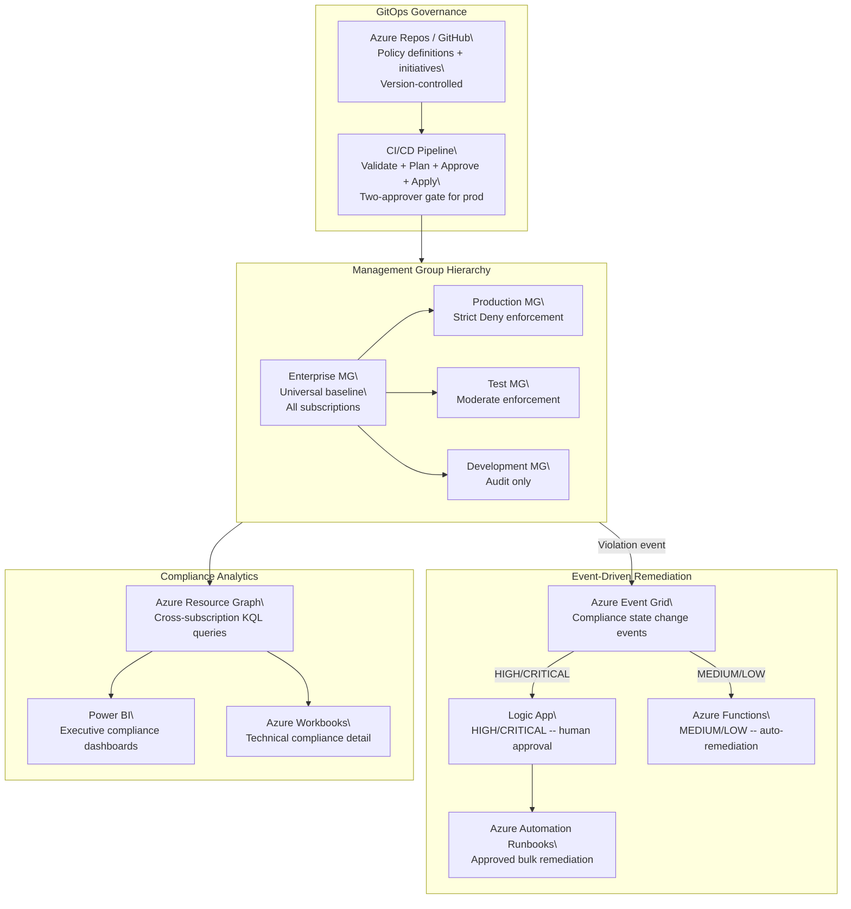

# Policy-as-Code Infrastructure Compliance Platform

[](https://sergeksfumey.com/projects/policy-as-code-infrastructure)
[]()
[]()
[]()

> **Design Study** -- Independent architecture exercise for enterprise Azure environments. Not associated with a production deployment.

Enterprise-scale Policy-as-Code governance platform -- Terraform-managed Azure Policy definitions and initiatives across management group hierarchy, environment-aware three-tier enforcement (Dev/Test/Prod), Event Grid-triggered remediation via Logic Apps and Azure Functions, Azure Resource Graph cross-subscription compliance analytics, and Power BI executive compliance dashboards.

Related: [Security-as-Code and DevSecOps Governance](https://sergeksfumey.com/projects/zero-trust-network-architecture) covers deployment-time security scanning and ASG segmentation.

---

## Architecture Diagram



---

## Management Group Hierarchy

Tenant Root Group
+-- Enterprise Management Group         (Universal baseline -- all subscriptions)
+-- Platform Management Group       (Platform baseline policies)
|   +-- Identity Subscription
|   +-- Connectivity Subscription
+-- Landing Zones Management Group  (Workload governance)
|   +-- Production Management Group (Strict Deny enforcement)
|   |   +-- Prod-Sub-01
|   |   +-- Prod-Sub-02
|   +-- Test Management Group       (Moderate enforcement)
|   |   +-- Test-Sub-01
|   +-- Development Management Group (Flexible Audit)
|       +-- Dev-Sub-01
+-- Sandbox Management Group        (Minimal governance -- exploration)
+-- Sandbox-Sub-01

Policy inheritance: assignments at Enterprise MG propagate to all child subscriptions automatically.
No per-subscription assignment management required.

---

## Three-Tier Governance Model

| Control | Development | Test | Production |
|---|---|---|---|
| Public IP on VMs | Audit | Deny | Deny |
| Diagnostic settings | Audit | Audit | DeployIfNotExists |
| Resource tagging | Audit | Deny | Deny |
| TLS minimum version | Audit | Deny | Deny |
| Approved VM SKUs | Disabled | Audit | Deny |
| Storage HTTPS only | Audit | Deny | Deny |
| Key Vault soft delete | Audit | Deny | Deny |
| Approved locations | Disabled | Audit | Deny |
| MFA for management | Audit | Audit | Deny |

Same policy definitions serve all environments -- effect parameter differentiated per initiative tier.
Dev receives Audit awareness without blocking. Production receives Deny without exception.

---

## Remediation Decision Matrix

| Violation | Severity | Path | Human Approval | Target MTTR |
|---|---|---|---|---|
| Public IP on workload VM | High | Automated Function | No | 5 minutes |
| Missing diagnostic settings | Medium | DeployIfNotExists | No | 30 minutes |
| Missing resource tags | Low | Automated Function | No | 15 minutes |
| Non-compliant VM SKU | High | Logic App workflow | Yes | 4 hours |
| Public storage blob access | Critical | Automated Function | No | 2 minutes |
| Missing NSG on subnet | High | Logic App workflow | Yes | 2 hours |
| Encryption disabled | Critical | Logic App workflow | Yes | 1 hour |

Separation principle: automated remediation only where corrective action has no plausible legitimate use case.
High-impact remediations route through human approval to prevent operational disruption.

---

## Executive Summary

Architected a cloud-native Policy-as-Code governance platform enabling automated compliance enforcement,
event-driven remediation, cross-subscription visibility, and executive reporting across Dev/Test/Prod
at enterprise scale.

Differentiating focus: operational compliance at scale -- how violations are detected in real time,
how remediation is automated without operational instability, how compliance state is queried across
hundreds of resources across multiple subscriptions, and how governance evidence surfaces to executives.

---

## Architecture Principles

- Governance as software: policy definitions version-controlled, peer-reviewed, CI/CD deployed
- MG hierarchy as distribution foundation: universal controls assigned once, inherit to all subscriptions
- Environment-aware effect differentiation: same definitions, different enforcement per environment tier
- Event-driven remediation: real-time violation response vs scheduled remediation cycles
- Separation of enforcement and remediation: independent failure modes, independent testing
- Mandatory exemption expiry: no permanent exemptions -- compliance debt prevented by design
- Cross-subscription analytics: Resource Graph for enterprise-scale visibility

---

## Design Decisions

### ADR-001 -- Management Group Hierarchy as Policy Distribution Foundation
**Decision:** All policy assignments via management group hierarchy
**Rationale:** Per-subscription assignment scales linearly with subscription count -- unsustainable at enterprise scale. MG inheritance: universal controls assigned once, propagate automatically to all child subscriptions.
**Trade-off:** MG restructuring requires policy reassignment planning. Initial hierarchy must account for future subscription additions.

### ADR-002 -- Environment-Aware Initiative Design with Effect Differentiation
**Decision:** Three-tier initiatives (Dev/Test/Prod) with differentiated effects using same policy definitions
**Rationale:** Uniform Deny across all environments blocks legitimate development. Three-tier maps enforcement severity to operational risk.
**Trade-off:** Three initiative sets to maintain. Mitigated by parameterised Terraform modules.

### ADR-003 -- Event-Driven over Scheduled Remediation
**Decision:** Azure Event Grid-triggered remediation on compliance state change
**Rationale:** Scheduled remediation leaves violations exposed for hours. Event Grid triggers near real-time -- MTTR from hours to minutes.
**Trade-off:** Event Grid compliance event volume at scale requires rate limiting, dead letter queuing, and idempotent function design.

### ADR-004 -- Azure Resource Graph for Cross-Subscription Analytics
**Decision:** Resource Graph KQL queries for compliance analytics
**Rationale:** Azure Policy portal provides single-subscription views only. Resource Graph executes across all subscriptions simultaneously.
**Trade-off:** Throttling limits (~15 queries/5 sec per tenant). Power BI must implement caching and scheduled refresh.

### ADR-005 -- Mandatory Exemption Expiry Dates
**Decision:** All exemptions require expiry date and justification in Terraform
**Rationale:** Permanent exemptions accumulate -- exempt resources become forgotten compliance gaps eroding posture.
**Trade-off:** Exemption renewal overhead. Justified by preventing long-term compliance debt accumulation.

### ADR-006 -- Automated vs Approved Remediation Separation
**Decision:** Automated Functions for LOW/MEDIUM, Logic App approval for HIGH/CRITICAL
**Rationale:** Auto-remediating all violations risks disruption -- removing public IP may break legitimate testing. Automated only where no plausible legitimate use case exists.
**Trade-off:** HIGH/CRITICAL violations have longer MTTR. Acceptable given operational impact risk of automated action.

---

## Technologies

| Category | Technologies |
|---|---|
| Infrastructure as Code | Terraform |
| CI/CD and GitOps | GitHub Actions + Azure DevOps + YAML Pipelines |
| Policy Governance | Azure Policy + Initiative Definitions + Management Groups |
| Cross-Subscription Analytics | Azure Resource Graph + KQL |
| Event-Driven Remediation | Azure Event Grid + Logic Apps + Azure Functions + Automation Runbooks |
| Monitoring | Azure Monitor + Log Analytics |
| Reporting | Power BI + Azure Workbooks |
| Security | Microsoft Defender for Cloud + Azure RBAC + Key Vault |
| Compliance Frameworks | CIS Azure Benchmark v2.0 + NIST SP 800-53 + PCI DSS v4.0 |

---

## Repository Structure
```
policy-as-code-compliance/
├── governance/
│   ├── modules/
│   │   ├── policy-definition/
│   │   ├── policy-initiative/
│   │   ├── policy-assignment/
│   │   └── policy-exemption/
│   ├── initiatives/
│   │   ├── production-baseline/
│   │   └── dev-baseline/
│   ├── definitions/
│   │   ├── network/
│   │   ├── data-protection/
│   │   └── operational/
│   └── assignments/
│       ├── production-mg.tf
│       └── dev-mg.tf
├── remediation/
│   ├── functions/
│   │   └── remediate_violations.py
│   └── runbooks/
│       └── Invoke-BulkRemediation.ps1
├── kql/
│   ├── cross-subscription-compliance.kql
│   ├── compliance-trend.kql
│   └── missing-tags-cross-subscription.kql
├── pipelines/
│   └── azure-pipelines-governance.yml
├── scripts/
│   ├── validate_policy_json.py
│   └── generate_impact_report.py
└── docs/
    ├── architecture.md
    ├── exemption-governance.md
    └── remediation-runbook.md
```
---

## Future Evolution

- OPA/Gatekeeper for Kubernetes workload governance via AKS admission control
- AI-assisted compliance anomaly detection for security incident vs routine drift distinction
- Cross-cloud governance federation (AWS Organizations, GCP Resource Manager)
- Continuous compliance validation pipelines with threshold alerting
- FinOps governance integration (approved VM SKUs, shutdown schedules, lifecycle tagging)
- Automated risk scoring and violation prioritisation by asset criticality

---

*Part of the [sergeksfumey](https://github.com/sergeksfumey) infrastructure architecture portfolio · [sergeksfumey.com](https://sergeksfumey.com)*
